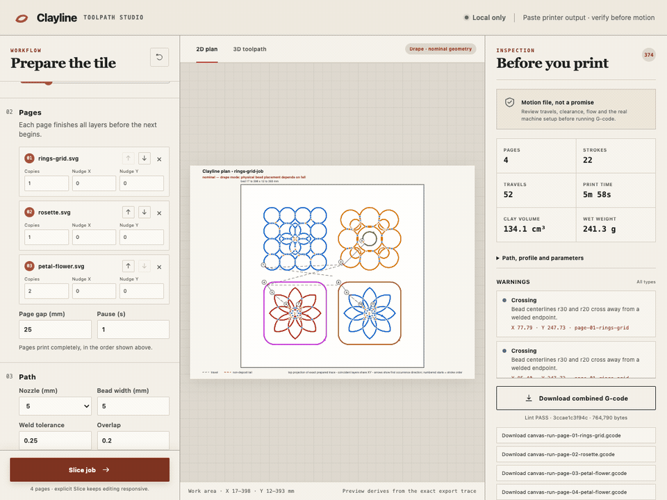

# Clayline

Clayline turns stroked SVG centerlines into layered, auditable paste-printer
toolpaths. Its primary target is Pete's PotterBot 10 XL and raised-nozzle
**drape printing**: the nozzle stays above the canvas while a soft clay coil falls
into place. Calibrated layer-by-layer Z is available for more conventional work.



**Download for Mac:** the [latest release](https://github.com/peterkatz/clayline/releases/latest)
runs on Apple silicon Macs with macOS 14 or later. Unzip it, then drag Clayline
into your Applications folder. The **[user guide](https://peterkatz.github.io/clayline/)**
covers installing, both modes, printing, calibration, and troubleshooting in
plain language; this README is the developer's view.

This is release `0.2.2`; [CHANGELOG.md](CHANGELOG.md) lists what each release
changed. The software pipeline has substantial local verification, but Clayline
has not yet passed its required full-tile physical print. It is not on PyPI.

> **G-code moves real machinery; use it at your own risk.** A lint PASS means the
> file is internally consistent with the selected profile. It does not prove that
> your actual printer, loaded clay, nozzle, cartridge, canvas, clearances, or
> emergency-stop setup is safe. Read the complete G-code, verify every machine
> fact, keep the emergency stop reachable, and stay with the printer.

## Current status

Status is based on committed evidence bundles under `docs/verification/` in the
maintainer's development repository. They are not part of this public snapshot
because they were built from the maintainer's own print jobs.

A fresh checkout does not pass the whole test suite yet: the golden-file and
evidence tests that still encode printer profile 1.3.0 fail against the current
1.4.0 profile and await regeneration. They test recorded output, not the
planner, and the shipped app is built from this tree.

| Milestone | Current verdict | Evidence / remaining gate |
|---|---|---|
| M0 — contracts and fixtures | PASS | M0 status |
| M1 — SVG ingest and flattening | PASS, independently verified | M1 status |
| M2 — profiles, emission, lint, calibration | Software PASS; physical calibration results pending | M2 status |
| M3 — continuous planner and warnings | Software PASS, independently clean-clone verified | M3 status |
| M4 — layers, drape mode, pages | Software PASS; flow `1.0` and overlap `0.20` remain provisional | M4 status |
| M5 — preview and report | Software PASS | M5 status |
| M6 — CLI, Python facade, local UI | Software PASS, independently clean-clone verified | M6 status |
| M7 — kiss-hop and release | Software PASS; physical product exit remains open | M7 status |
| M8 — native macOS app | PASS; Developer ID-signed and notarized 0.1.0 download published | M8 status |
| M9 — artist-first UX overhaul (scrubber, honest defaults, fuse/lap re-cut, pages sidebar, live bed fit) | PASS — verified live in-app + two independent clean-env verifiers | M9 status |
| M10–M14 — Weave mesh mode | Software PASS; synthetic, real TwistTumbler/GH parity, clean-snapshot, and installed-app gates verified | M13 status · M14 status · completion audit; current nozzle confirmation remains pending |
| M16 — Weave print range + reprint-this | Software PASS; real tumbler broken-rim trim restores Z-blend and reproducible restore is byte-identical | M16 status |
| Tiles product exit | NOT RUN | A full PotterBot XL tile must be printed in drape mode and accepted |
| Weave product exit (M15) | NOT RUN | M15 status and provisional print sheet; Pete must print and accept a Weave tumbler |

## Reading your toolpath

After **Slice**, the preview shows exactly what will be exported — it is drawn
from the same audited trace as the G-code, never a simplification.

- **Scrub the print.** Drag the slider under the preview to watch the print
  from any move to any move, or press play to animate the nozzle. Arrow keys
  step one move, Shift+arrows one stroke, PageUp/PageDown one pass.
- **Isolate a pass.** Tiles are built by repeating the path; the pass chips
  (1…N) show any single pass on its own — essential in drape mode, where all
  passes can share one nominal Z.
- **Read the readout.** While scrubbing you always see the move number, X/Y/Z,
  whether clay is flowing (extruding / travel / non-deposit tail), the pass,
  the page, and which SVG element the line came from.
- **Trust the Construction block, question the Warnings.** Fuse points and
  laps are how coil tiles are built and live under *Construction*; anything
  under *Warnings* is something you may actually want to change.

The stats panel separates plan facts (strokes in your design) from motion
facts (passes × strokes the machine runs), and the pass control always shows
the physical result: "6 passes × 2.0 mm = 12 mm tall".

## Use the Mac app

Clayline now has a native Apple-silicon app for macOS 14 or newer. The app bundles
the Python slicing engine and the complete interface, so normal use does not need
Python, Terminal, a browser, or an internet connection.

The app carries a gallery of 98 example drawings, sorted into folders by
tradition. **Browse the gallery** in the Design step, or **File → Open from
Gallery…**, opens it; until you have opened a drawing from a folder of your own,
adding a drawing starts there too. The folders are built at packaging time from
[examples/gallery-manifest.json](examples/gallery-manifest.json) by
`tools/build_gallery.py`; the source files stay flat under `examples/`.

Open **Clayline**, choose one or more centerline SVGs, arrange the ordered Pages
list, set the shared size and drape parameters, then select **Slice job**. Use the
export buttons or **Shift-Command-E** to save G-code through the native macOS
save panel. **Command-S** saves the whole job instead — the drawings or the
model, and every setting — as one Clayline project file, and **Shift-Command-O**
opens one again with everything as you left it. **Command-O** imports more SVGs,
and SVGs or `.clayline` projects opened from Finder are handed to the running
app.

With two or more pages, the Pages section enables **Bed / Stack**. Bed is the
default and lays pages out across the build surface. Stack holds them on one XY
origin and starts each page above the accumulated relief below it. For a one-page
job the choice stays on Bed and is disabled with an explanation.

The bundled engine listens on a random localhost port for the life of the app. A
new private session cookie is required on every launch, and the helper exits when
Clayline quits. It is not a cloud service and does not expose the studio to the
LAN.

The public download on the [Releases page](https://github.com/peterkatz/clayline/releases/latest)
is a signed arm64 build. Developers can assemble the same `build/Clayline.app`
with `make mac-app` and notarize their own with `make notarize`; that build step
is not part of the ceramicist workflow.

## Developer/source install (optional)

Python 3.11 or newer is required. The primary isolated CLI install is:

```console
cd clayline
pipx install '.[ui]'
clayline --version
```

The `[ui]` extra installs the local web studio. For only the CLI and Python API,
use `pipx install .`.

Clayline owns its deterministic emission core. Installation resolves only declared
package-index dependencies; it no longer fetches a G-code engine from a Git
repository. Clayline makes no external network calls at runtime.

If you do not use `pipx`, install into a virtual environment:

```console
cd clayline
python3 -m venv .venv
. .venv/bin/activate
python -m pip install '.[ui]'
clayline --version
```

## Weave mode in 60 seconds

Weave mode turns a closed OBJ, STL, 3MF, or PLY mesh into an in/out wobble or
woven vessel path. The runnable walkthrough deliberately uses a small
**synthetic stand-in**. Real TwistTumbler exports and their Grasshopper
statistics reference live under `tests/fixtures/reference/`; they are frozen
verification inputs, not machine-ready example jobs.

First inspect the placed mesh and slice statistics without building a pattern
or writing artifacts:

```console
clayline weave examples/weave/pete-job.obj \
  --layer-height 2 \
  --sample-spacing 1 \
  --dry-run
```

Then execute the canonical synthetic job and lint its exact output:

```console
bash examples/weave/pete-job.sh demo-out/weave-pete-job
```

Open `demo-out/weave-pete-job/pete-job.html`, read the warning and JSON report,
and inspect the G-code before any machine use. The pattern file carries its
waveform, extrusion curve, amplitude, wavelength, twist, z-blend, bottom, and
seam settings. The recipe repeats those values as CLI overrides to make the
complete public surface legible. Built-in wave presets are `flat`, `sine`,
`triangle`, `sawtooth`, `rounded-square`, `pulse`, and `noise`; use an explicit
seed for reproducible Noise, for example `--wave noise --wave-seed 8675309`.

Wavelength is physical spacing in millimetres. Every closed ring uses its own
half-up rounded whole wave count so the seam closes exactly. On a taper, that
keeps approximate peak spacing constant while ribs and over-under alignment
intentionally drift as circumference changes.

Print only a test or trimmed wall band with one-based, inclusive layer numbers:

```console
clayline weave model.obj --layer-range 8 20 -o model-8-20.gcode
```

The selected band is a live Stage-B view of the cached slice and is rebased to
the bed; it never slices the mesh again. Its G-code states, for example,
"printing layers 8–20 of 32, rebased to the bed." Bottom layers are unavailable
unless the range begins at source layer 1.

Restore every saved Weave setting and pattern from a reproducible artifact:

```console
clayline weave --from previous.gcode model.obj -o reprint.gcode
```

If the original mesh sits beside the G-code under the filename recorded in its
header, the mesh argument may be omitted. Restore compares SHA-256 content—not
just the filename—and warns honestly before continuing with a different mesh.

## Previewed G-code in ten minutes

These commands run from the repository root and write only to `demo-out/`. They
generate a three-layer, constant-height drape job; they do **not** authorize a
printer run.

First inspect the profile and available nozzle choices:

```console
clayline profiles list
clayline profiles show potterbot-xl
```

Then generate G-code, a 2D plan, an offline 3D preview, and a JSON report from the
same emission trace:

```console
mkdir -p demo-out
clayline plan examples/gallery/rings-grid.svg \
  --profile potterbot-xl \
  --nozzle 5 \
  --layers 3 \
  --layer-height 2 \
  --scale fit:180 \
  --z-mode drape \
  --standoff 20 \
  --z-step 0 \
  --reproducible \
  -o demo-out/rings-grid.gcode \
  --plan-png demo-out/rings-grid-plan.png \
  --preview demo-out/rings-grid.html \
  --report demo-out/rings-grid-report.json

clayline lint demo-out/rings-grid.gcode
```

Open `demo-out/rings-grid.html` in a browser and inspect every warning, travel,
layer, bound, and profile parameter. The tile fixtures intentionally surface real
crossing, curvature, spacing, and open-end warnings. Warnings exit zero but print
loudly; add `--strict` when you want any warning to fail a planning command.

For the local studio, run:

```console
clayline ui
```

It opens on `http://127.0.0.1:8765`. The server binds to localhost only. Use
`clayline ui --no-browser` when you do not want it to open a browser tab.

## Calibrate before printing

Do not treat the demo's default flow `1.0`, the default overlap, or a lint-clean
file as physical calibration. Select the nozzle actually fitted to the machine,
generate the calibration set, and read the generated instructions:

```console
clayline calibrate all \
  --profile potterbot-xl \
  --nozzle 5 \
  -o demo-out/calibration

cat demo-out/calibration/PRINT-INSTRUCTIONS.txt
clayline lint demo-out/calibration/flow-ladder.gcode
clayline lint demo-out/calibration/ring.gcode
clayline lint demo-out/calibration/kiss-pair.gcode
```

On the machine, the intended order is flow ladder, ring closure, then kiss-pair
fusion. Inspect each file before motion and record the accepted flow and overlap.
Those physical selections are still pending for this project; no value in the
README substitutes for them.

## Sequential multi-page jobs

Multiple SVG arguments form an ordered job. Each page prints all of its layers
before the next page starts. The default `--page-mode bed` arranges those pages
side by side. In Bed mode, `--split-pages` also writes independently printable
per-page files; the combined file remains the sequential job. For the PotterBot
profile, `--page-pause` is a timed dwell in seconds, so choose enough time for the
intended canvas workflow and verify the emitted pause commands yourself.

```console
clayline plan \
  examples/gallery/rings-grid.svg \
  examples/gallery/rosette.svg \
  examples/gallery/petal-flower.svg \
  --profile potterbot-xl \
  --nozzle 5 \
  --layers 2 \
  --layer-height 2 \
  --scale fit:100 \
  --z-mode drape \
  --standoff 20 \
  --z-step 0 \
  --page-gap 25 \
  --page-pause 30 \
  --split-pages \
  --reproducible \
  -o demo-out/tiles.gcode \
  --plan-png demo-out/tiles-plan.png \
  --preview demo-out/tiles.html \
  --report demo-out/tiles-report.json

clayline lint demo-out/tiles.gcode
```

To repeat one design as separate pages, pass one SVG plus `--copies N`.

For layered relief, `--page-mode stack` auto-centers every SVG on the same origin
and raises each later page above the accumulated stack. In calibrated mode the
next first layer starts one first-layer height above the prior top. In drape mode,
the standoff is measured above that top. The report lists every page's Z range and
the total stack height; `over_void` identifies upper paths without a supporting
bead within one bead width (information in drape mode, warning in calibrated).
Stack mode is combined-output-only. `--split-pages` is rejected because each
standalone file would replay the profile's fixed start block; on a built stack,
that motion can descend into printed material. Bed-mode split export is unchanged.

```console
clayline plan \
  examples/gallery/rings-grid.svg \
  examples/gallery/rosette.svg \
  --page-mode stack \
  --profile potterbot-xl \
  --nozzle 5 \
  --layers 2 \
  --z-mode drape \
  --standoff 20 \
  --z-step 0 \
  --reproducible \
  -o demo-out/relief-stack.gcode \
  --preview demo-out/relief-stack.html \
  --report demo-out/relief-stack-report.json
```

## Python API

The facade below matches the current immutable pipeline: ingest once, plan once,
stack and emit once, then derive the report and previews from that exact prepared
trace.

```python
import json

import clayline as cl

design = cl.load_svg("examples/gallery/rings-grid.svg", scale="fit:180")
plan = design.plan(nozzle=5.0, weld_tol=0.25)
result = plan.stack(
    profile="potterbot-xl",
    layers=3,
    layer_height=2.0,
    alternate=True,
    z_mode=cl.ZMode.DRAPE,
    standoff=20.0,
    z_step=0.0,
    reproducible=True,
)

print(json.dumps(result.report().to_dict(), indent=2, sort_keys=True))
result.plan_png("demo-out/api-rings-grid-plan.png")
result.preview("demo-out/api-rings-grid.html")
result.write_report("demo-out/api-rings-grid-report.json")
result.write_gcode("demo-out/api-rings-grid.gcode")
```

For multi-page or fully parameterized integrations, build a
`clayline.PipelineRequest` and pass it to `clayline.build_pipeline`.

### Weave Python facade

The mesh facade follows the same one-result rule: slice once, modulate once,
then derive every artifact from that immutable audited result.

```python
import json

import clayline as cl

form = cl.load_mesh("examples/weave/pete-job.obj", up="z")
sliced = form.slice(layer_height=2.0, sample_spacing=1.0)
job = sliced.modulate(
    pattern="examples/weave/pete-job.pattern.json",
    extrusion="pattern",
    amplitude=3.0,
    wavelength=18.0,
    twist=0.5,
    z_blend=True,
    level_rim=True,
    bottom_layers=3,
    seam="chained",
    overlap_fraction=0.2,
    reproducible=True,
    prime_mm=0.0,
    end_early_mm=0.0,
)

print(json.dumps(job.report().to_dict(), indent=2, sort_keys=True))
job.preview("demo-out/api-pete-job.html")
job.write_report("demo-out/api-pete-job-report.json")
job.write_gcode("demo-out/api-pete-job.gcode", profile="potterbot-xl")
```

The `profile` passed to `write_gcode` must match the profile already used for
mesh placement and emission. To change profiles or flow, rebuild the immutable
result so the preview, report, lint, and exported bytes cannot diverge.

## Drape mode is nominal, not a simulation

With `--z-mode drape --standoff 20 --z-step 0`, commanded print Z stays at a
constant nominal 20 mm. The preview shows the commanded toolpath. It cannot predict
where a falling, stretching wet coil will land, how prior coils will deform, or how
quickly the growing tile approaches the nozzle. Crossings are demoted to information
in drape mode because they can be intentional, not because the physical risk has
disappeared. Start conservatively and watch clearance continuously.

Calibrated mode instead follows layer height and applies first-layer behavior. A
helical ramp is intentionally incompatible with drape mode.

## Printer profiles and trust

- `potterbot-xl` is **verified only for the facts recovered from Pete's successful
  reference print and the cited vendor specifications**: start/end blocks,
  absolute extrusion, virtual 1.75 mm filament E math, machine center, work and
  machine bounds, and 30/40/120 mm/s profile speeds. That evidence does not
  establish clay flow, current machine state, or a successful Clayline tile print.
- `generic-marlin-paste` and `generic-reprap-paste` are explicitly
  **UNVERIFIED** templates. Replace their bounds, speeds, nozzle list, and G-code
  with evidence from your own printer before considering motion.
- `clayline profiles show NAME_OR_PATH` exposes the selected facts. A local TOML
  path uses the same loader and validation as a bundled profile.

## Offline and private at runtime

Clayline has no telemetry and makes no external runtime network requests. The web
UI binds to `127.0.0.1`; its assets are packaged locally. The Mac app adds a
per-launch authenticated session on an ephemeral loopback port and shuts its helper
down with the app. Generated Plotly HTML previews are self-contained and can be
opened offline. Source installation may need the configured package index unless
the declared dependencies are already cached.

## Known limitations

- Physical flow, overlap, ring closure, kiss fusion, and full-tile drape acceptance
  are pending. The product exit gate is not green.
- M7 software acceptance is green after Pete approved the 152.4 mm photo
  tracings as the canonical fixtures. At the unchanged default 1 mm fuse
  tolerance, rings-grid is **1 stroke / 0 travels**, rosette is **1 / 0**, and
  petal-flower is **2 / 1**. This does not satisfy the separate physical product
  exit gate; Pete has not yet printed and accepted a full drape-mode tile.
- Current examples contain substantial, intentionally visible planner warnings.
  They are test and inspiration assets, not cleared production files.
- SVG input is stroked centerline geometry. Filled-only artwork is reported and
  dropped rather than silently treated as a printable outline.
- There is no send-to-printer, non-planar draping, Windows app, or PyPI release.

See the [examples gallery](examples/README.md), the
product contract, and [CONTRIBUTING.md](CONTRIBUTING.md).

## License

Copyright (C) 2026 Pete Katz. Clayline is released under the GNU General Public
License, version 3; see [LICENSE](LICENSE). Contributions are accepted under the
contributor agreement in [CONTRIBUTING.md](CONTRIBUTING.md).
The vendored Plotly.js UI asset is MIT-licensed; its full notice ships beside the
asset at `src/clayline/webui/static/plotly-LICENSE.txt`.
