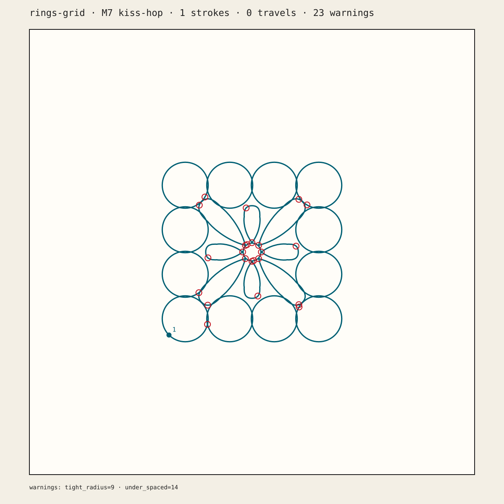
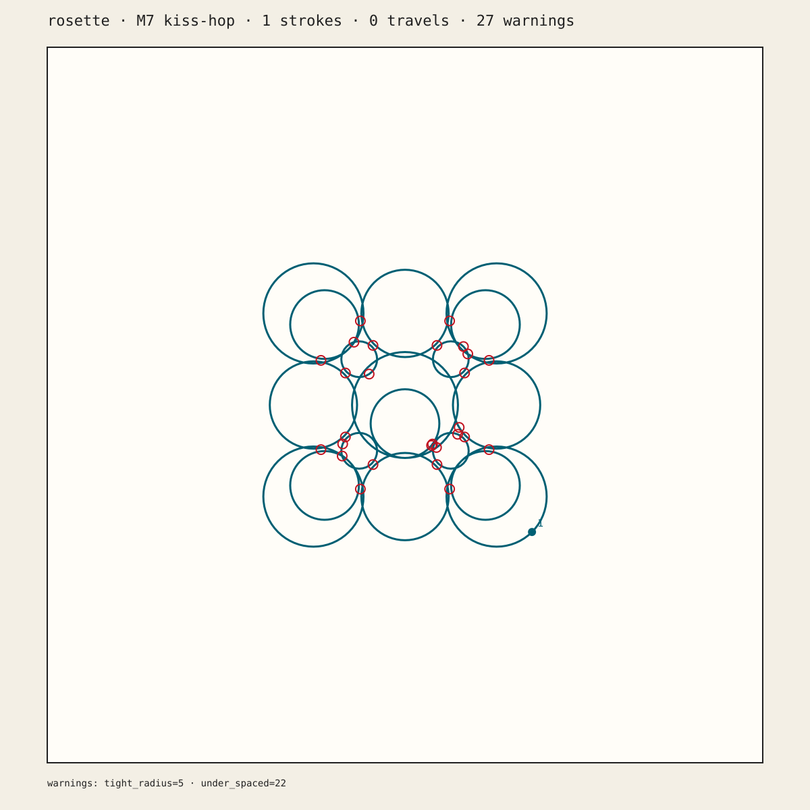
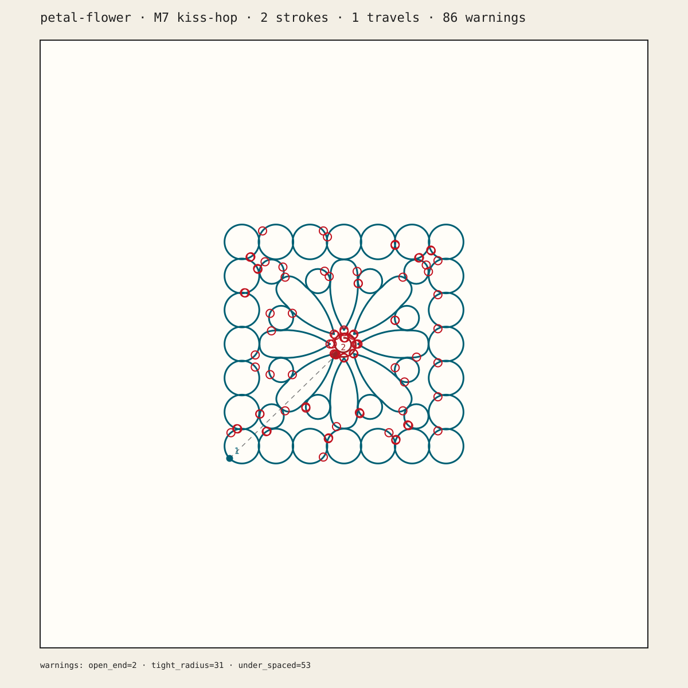

# Clayline example gallery

## Weave mesh example

| Example | Inputs | Status |
|---|---|---|
| **pete-job synthetic stand-in** | [mesh](weave/pete-job.obj) · [canonical pattern](weave/pete-job.pattern.json) · [runnable job recipe](weave/pete-job.sh) · [walkthrough](weave/README.md) | Software fixture only; not Pete's H2 TwistTumbler or Grasshopper reference, and not physically printed |
| **ribs-job / spiral-job / flat-job** | [named canonical patterns](weave/README.md#named-synthetic-job-fixtures) · shared synthetic mesh above | Visual-regression fixtures only; printer settings remain provisional |

The Weave example exercises the whole mesh → slice → wave → audited G-code
path without waiting for H2. Its name identifies the product-contract job; its
geometry and expected stats remain synthetic until Pete supplies the real
reference inputs.

## Tiles SVG examples

These three 6 × 6 in (152.4 × 152.4 mm) photo tracings are the production tile
fixtures copied into `tests/fixtures/svg/`. They are stroked centerline artwork
in millimetres and can be scaled at ingest. They intentionally retain topology
and warnings that exercise the real planner; none is presented as a print-ready
universal file.

| Example | Generated Clayline plan view | Source-photo relationship |
|---|---|---|
| [rings-grid.svg](gallery/rings-grid.svg) |  | Traced from IMG_3074.jpg |
| [rosette.svg](gallery/rosette.svg) |  | Traced from IMG_3073.jpg |
| [petal-flower.svg](gallery/petal-flower.svg) |  | Traced from IMG_3071.jpg |

The plan images above are real software-generated M7 evidence. The source photos
are **inspiration/reference objects**, not Clayline outputs, and they do not prove
that these SVGs or the generated G-code have been physically printed.

## What each example exercises

- **rings-grid** — perimeter rings and a central rosette. Stage A produces
  21 strokes / 20 travels; default-tolerance kiss-hop produces 1 / 0.
- **rosette** — nested photo-traced rings designed around contact. Stage A
  produces 18 / 17; default-tolerance kiss-hop produces 1 / 0.
- **petal-flower** — border rings, petals, and a deliberately open coiled hub.
  Stage A produces 45 / 44; default-tolerance kiss-hop produces 2 / 1.

Those kiss-hop numbers describe measured geometry at the default 1 mm fuse
tolerance. They resolve M7's fixture-topology blocker without relaxing the
bounded-hop contract. See
`docs/verification/M7/STATUS.md` for the
software gate and the remaining physical-print exit gate.

## Generate your own artifacts

Run the single-page or multi-page commands in the main
[README](../README.md). Generated G-code is deliberately not duplicated here:
it depends on the selected printer profile, nozzle, layer, flow, Z mode, and
placement. For auditable software evidence, inspect the committed
M7 rings-grid G-code, its
lint report, and the
offline 3D preview. Those
files demonstrate one exact verified pipeline run; they are not universal
ready-to-print files.
