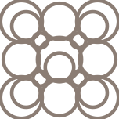
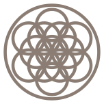
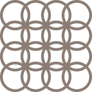
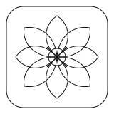
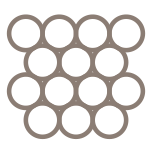

{ .cl-hero-mark alt="" }

# Clayline Toolpath Studio

Drawings and 3D models in. Print files for clay paste printers out.

[Download for Mac](https://github.com/peterkatz/clayline/releases/latest){ .md-button .md-button--primary }
[Read the guide](install.md){ .cl-quiet }

For Apple silicon Macs running macOS 14 or later. Free and open source.

<figure class="cl-demo" markdown>

<figcaption>A drawing on the bed, and the path the nozzle will follow through it.</figcaption>
</figure>

## Two ways to work

### Draw in Clay

Draw a pattern as lines, either in Clayline itself or in any vector drawing app saved as an SVG, or start from the gallery of 98 example drawings that comes with the app. Clayline turns every line into a coil of clay, joins lines where they meet, and repeats the design pass after pass to build height. Print it flat as a tile, or let the coil drape from a raised nozzle for open lacework.

### Weave

Open a 3D model of a tumbler or vessel. Clayline slices it into rings and prints the wall as one continuous thread of clay, with a wave pattern you shape yourself: ribs, spirals, crisp edges, or a texture traced from a real print.

Both modes show you the exact path the printer will follow, in 2D and 3D, and a **Before you print** panel that lists everything worth a look before you commit clay.

## Start from a drawing

Six of the 98 drawings that come with the app. Open one, redraw it, or bring your own.

## Where to start

- [Install](install.md): get the app running and pick your printer.
- [Draw in Clay](tiles.md): from a line drawing to a printed tile.
- [Weave](weave.md): from a 3D model to a woven vessel.
- [Printing](printing.md): what the printer does with the file, and the three settings that decide how the first layer lands.
- [Troubleshooting](troubleshooting.md): the first layer scraped, the start blob is huge, the model loads sideways.

## Built for real printing

Clayline was built around a PotterBot 10 XL and shaped by real prints. Everything runs on your Mac: no account, no cloud, no internet connection needed. Nothing ever prints from the app itself. It writes a file, you look it over, and you take it to the printer.

!!! warning "Printer files move real machinery"
    Clayline checks every file against the printer's limits, not against your actual printer, clay, nozzle, or the space around it. Look the file over, keep the emergency stop within reach, and stay with the printer. Read [Safety](safety.md) before your first run.
