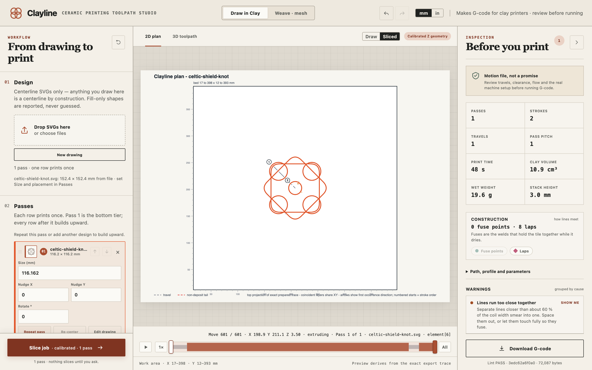
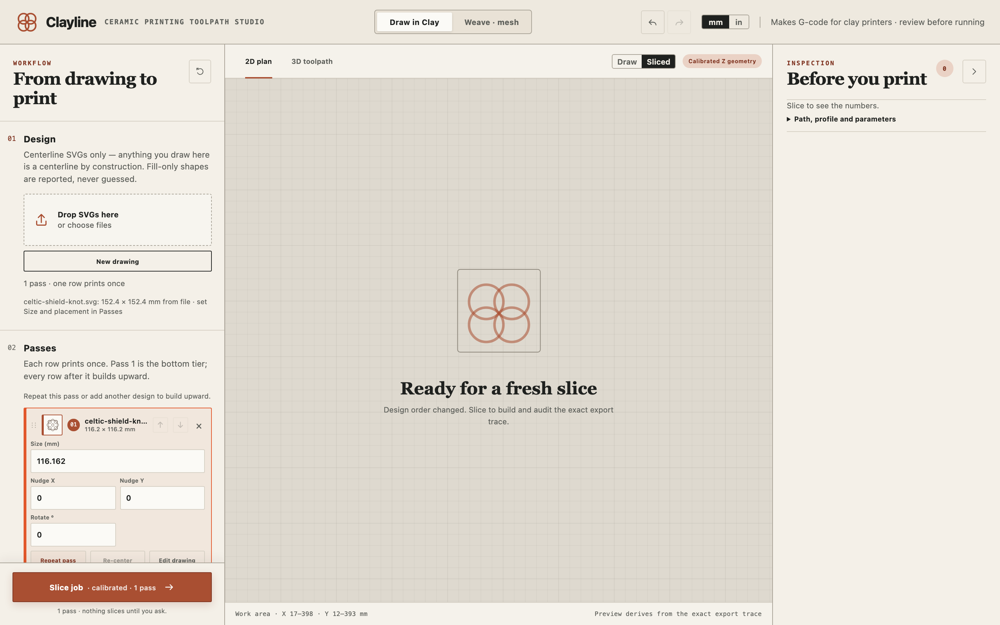
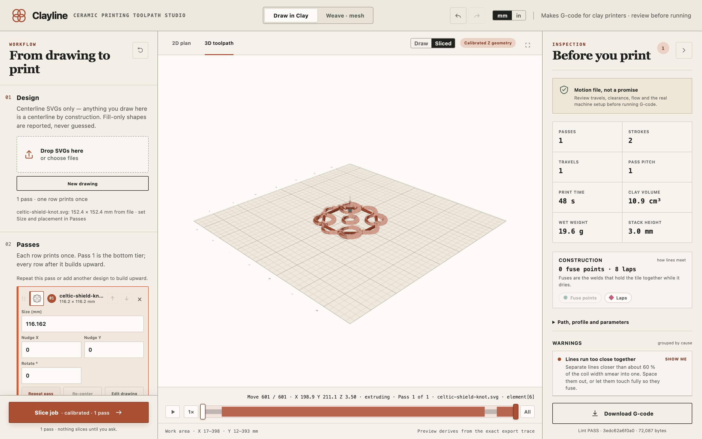

# Draw in Clay

From a line drawing to a printed tile or open lacework. This is the mode Clayline opens in.

## How Clayline reads a drawing

Every line you give Clayline becomes the centre of a coil of clay. That one idea decides how to draw:

- **Draw with lines, not filled shapes.** A filled circle is not a ring to Clayline; it is reported in the warnings and left out. Draw the ring as a line.
- **Line weight doesn't matter.** A hairline and a fat stroke print the same coil. The coil width comes from the nozzle, not the drawing.
- **Draw in millimetres, at real size.** The gallery tiles are 152.4 mm square. You can resize a design after loading it, but drawing at real size keeps you honest about what the nozzle can do.
- **Touching shapes join.** Where two lines meet, or two closed rings touch, Clayline prints straight through the joint as one stroke. Draw joins as real overlaps or gaps under about 0.8 mm. A gap of exactly 1 mm sits right on the edge of the join tolerance and may go either way.
- **Don't leave a loop floating.** A ring that touches nothing is a separate piece after firing.
- **Keep curves gentle.** A curve tighter than about twice the nozzle opening smears into a blob. Keep a few millimetres clear of the bed edge.

You can draw in any vector app and save as SVG, or draw straight onto the bed in Clayline.

### Drawing inside Clayline

Press **New drawing** under 01 Design, or **Start a drawing** in the empty preview. The bed becomes a drawing surface at coil width.

- Tap a point, then the next, for a straight line that keeps chaining. **Enter** or **Esc** ends the line; tap the first point to close a loop.
- Drag on empty bed to draw freehand. It settles into editable points when you let go.
- Pull any line and it bends into an arc under your cursor. Drag a point to move it; **Option-click** a line to add a point; **Delete** removes what's under the cursor.
- **Rings**, **Box**, and **Polygon** drag a shape onto the bed. **Shape & repeat** opens mirroring, repeats, and corner rounding.
- **Reference** places a photo under the drawing to trace. Drag it to move, a corner to resize, the handle above to turn it. It never prints.

Nothing plans while you draw. Press **Done**, then **Slice job**.

## The workflow, top to bottom

### 01 Design

Drop one or more SVG files on the box, or click it to choose them. Each file becomes one pass, in the order you add them. The line under the box tells you the file's size and that its placement lives in Passes.

### 02 Passes

Each row is one pass through a design, and each pass prints once. Pass 1 is the bottom tier; every row after it builds upward.

For each row you can set **Size**, nudge it in **X** and **Y**, and **Rotate** it. **Re-center** puts it back on the middle of the bed. **Repeat pass** adds another tier of the same design, which is how a flat drawing becomes a tile with height. **Edit drawing** opens it on the bed, and **Save SVG…** writes that one pass back out as a drawing file. Drag the grip at the left of a row, or use the arrows, to change the print order: earlier rows print first.

Passes are always tiers. Even when two rows hold different designs, the second prints one layer height above the first, so a job with three rows finishes three layers tall. To print two separate tiles, slice them as two jobs.

Once designs are loaded, a **Bed map** shows where every pass sits on the printer bed and whether it fits, checked live before you slice. **Pause between passes** adds a timed pause after every pass except the last, for a look or a canvas change.

### 03 Layers

This section sets the physical coil and how each pass rises from the bed.

| Setting | What it does |
|---|---|
| **Nozzle opening** | The nozzle you actually fitted. The sizes listed come from the chosen printer. The coil width follows it. |
| **Layer height** | How far the nozzle rises each pass. Starts at 30% of the nozzle (a 5 mm nozzle gives 1.5 mm) and follows the nozzle until you type your own value. Click **AUTO** to follow again. |
| **Calibrated / Drape** | Calibrated: the nozzle rides at layer height and steps up precisely each pass. Drape: the nozzle rides high above the work and the coil falls onto the canvas. |
| **Work surface above Z zero** | How high the surface you print on sits above the printer's own zero, if you print on a board, canvas, or slab. Added to every height in the file. 0 means printing straight on the bed. |
| **First layer height** | The nozzle height for the very first pass only, which sets how hard the first coil is pressed onto the bed. Never changes the spacing of later passes. |
| **Nozzle height above canvas** | Drape mode only. How high the nozzle rides above the canvas while the coil falls. The verified setup uses 20 mm. |
| **Raise nozzle each pass** | Drape mode only. How much the nozzle rises after each pass. 0 keeps it fixed while the stack grows up toward it. |

The readout under these settings tells you what your numbers mean in clay: how much clay goes into each millimetre of line, how much the coil is squashed, how far apart side-by-side lines sit, and how much free coil there is before it squashes. Its last line is a verdict on the squash:

- **Welds solidly.** The passes will bond.
- **Lightly pressed.** Fine for open work, weak for stacked relief.
- **Barely pressed.** Passes will peel apart as they dry. Lower the layer height, or measure the coil: a real coil is wider than its nozzle.
- **Pressed very hard.** The nozzle may plough through what it just laid. Raise the layer height.

Watch this line whenever you change the nozzle, the layer height, or the coil width.

Three switches shape how passes build on each other:

- **Alternate direction each pass** runs every other pass backwards, so any lopsidedness in the flow doesn't pile up on one side. It turns on by itself when you add a second pass.
- **Seamless spiral** climbs continuously around each closed loop instead of stepping up pass by pass, so a tall form has no seam where layers meet. Needs Calibrated mode and every stroke closed into a loop.
- **Settle into valleys** lets the nozzle sink where the design crosses open gaps in earlier passes, laying clay on what is really there instead of bridging air. It only sinks where the nozzle fits.

Under **Advanced**, **Measured coil width** is where a calibration result goes: if a laid test line comes out wider or narrower than the nozzle, choose Measured and enter the real width.

### 04 Path

How closely the path follows the drawing and joins its lines.

| Setting | What it does |
|---|---|
| **Follow curves within** | How closely curves are traced, in millimetres. Under a clay coil anything finer than 0.1 mm is invisible; coarser values make lighter files. |
| **Join ends that nearly touch** | Line ends within this distance count as the same point, so slightly rough hand-drawn corners still join into one stroke. Starts at 0.25 mm. |
| **Side-by-side join** | How deeply two coils that run next to each other press into one another, as a percentage of the coil width. 20% of a 5 mm coil is 1 mm. |
| **Draw touching rings in one stroke** | Where closed rings touch, the stroke hops across the touching point and keeps flowing. A grid of tangent rings prints as one stroke with no travels. |
| **Protect the thread** | Adds extra clay where the thread starts, finishes, crosses clay, or bridges a gap, by slowing the nozzle there so the extruder keeps its normal pace. Off, +50%, or +100%. |

### 05 Character

A gentle hand-made rhythm, off by default. **Hand ripple · flow** pulses how much clay flows so the coil swells and thins like a hand-rolled one. **Hand ripple · height** waves the nozzle height for a hand-made surface. **Ripple length** sets how long each wave is.

### 06 Printer

Choose your printer. **Clay flow** scales how much clay is pushed per millimetre: above 1.00 lays a fatter coil, below it a leaner one. **Start charge** is the push of clay the printer makes over the bed centre before the first line. Leave it blank for the printer's normal amount, type a smaller number, or type 0 to skip it. See [Printing](printing.md) for how these three work together at the start of a print.

### 07 Export

**Save as** names the file. Leave it blank and Clayline names it after your design. **Reproducible output** leaves the timestamp out of the file so slicing the same job twice gives an identical file, which is useful for comparing.

### Slice job

Builds the toolpath, checks it, and draws both previews. Nothing prints from here. The button tells you which mode and how many passes it's about to build.

## Reading the result

**2D plan** shows the bed from above with every pass laid out. **3D toolpath** shows every printed move at its real height; drag to orbit, scroll to zoom. The **Draw / Sliced** switch flips between your editable drawing and the checked path from the last slice.

The **scrubber** under the preview walks through the print move by move. Press play to animate the nozzle, drag the handle to jump anywhere, or use the arrow keys: one move at a time, Shift-arrow for one stroke, Page Up and Page Down for one pass. The readout above it always tells you the move number, where the nozzle is, whether clay is flowing, which pass and which file that move came from. The numbered chips isolate a single pass, which matters in drape mode where every pass shares one nominal height.

**Before you print**, on the right, is the inspection. Passes, strokes, travels, print time, clay volume, wet weight, and the finished height. **Construction** counts how lines meet: fuse points are the welds that hold a tile together while it dries; laps are where lines run over each other. Trust Construction; question **Warnings**. Anything worth a look is listed there, grouped by cause, and **Show me** jumps the preview to the spot. A design in this guide's screenshots, for example, has two lines running closer than the coil can separate.

**Download G-code** saves the checked file. The line under it confirms the file passed Clayline's check and names it, so you can tell files apart later.

### Warnings you may see

| Warning | What it means |
|---|---|
| **A shape was skipped** | A filled shape with no line was left out. Redraw it as a line. |
| **No physical size in the file** | The drawing declared no units, so one drawing unit was taken as one millimetre. Check the size in Passes. |
| **Lines run too close together** | Two separate lines sit closer than about 60% of the coil width and will smear into one. Space them out or let them touch fully. |
| **Curve too tight for the nozzle** | A bend sharper than the nozzle can follow cleanly. **Round this corner** in the drawing tools fixes it in one click. |
| **A line ends in the open** | A free coil end cracks while drying. Close the loop or anchor the end on another line. |
| **Line crosses over another** | The clay stacks double height there, and in Calibrated mode the nozzle can strike it on a later pass. In Drape mode the coil simply drapes over, and this is only noted. |
| **Outside the printable area** | Part of the job falls off the bed. The Bed map shows where. |
| **Line above open space** | A line sits over a gap in the tier below it. Settle into valleys can help. |
