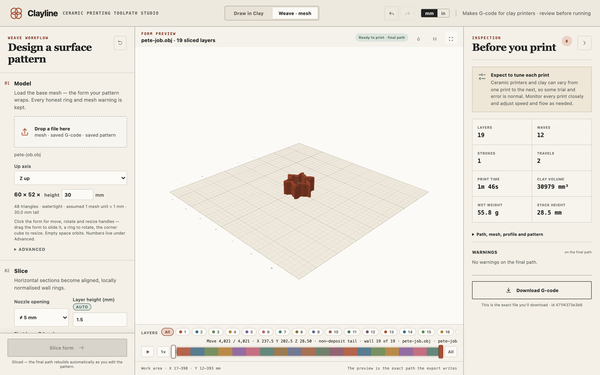
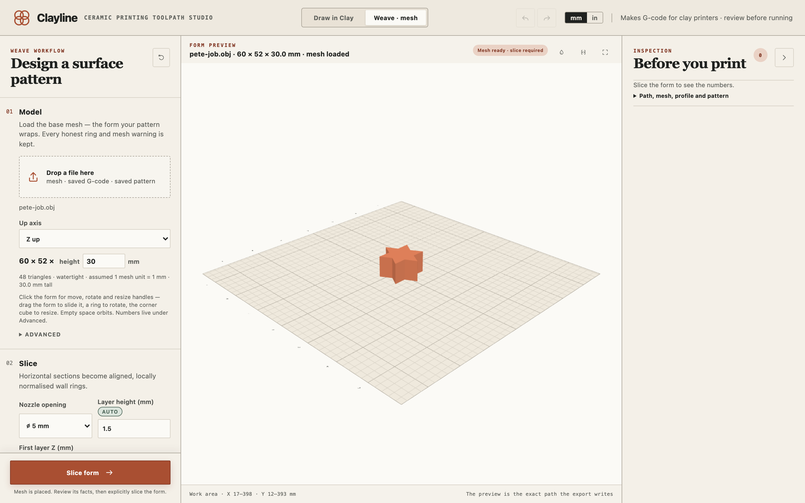

# Weave

From a 3D model of a vessel to one continuous thread of clay with a wave pattern in its wall. Switch to it with **Weave · mesh** at the top of the window.

## What Weave does

Clayline cuts the model into horizontal rings, one per layer. Then it prints the wall as a single thread that climbs from ring to ring, moving in and out of the original surface according to a wave you shape. Stack the wave's crests and you get vertical ribs. Offset them by half a wave each layer and the wall weaves. Turn them a little each layer and the pattern spirals up the pot.

The pattern is applied live: once the form is sliced, every change to the wave redraws the final path in front of you.

## The workflow, top to bottom

### 01 Model

Drop a mesh file on the box: STL, OBJ, PLY, or 3MF, in millimetres. The same box also takes a print file Clayline saved earlier, to restore every setting from it, or a saved pattern.

**Up axis** says which way is up in the file. Rhino exports are usually Y up. If the sliced rings look like a tangled contour map instead of stacked walls, flip this.

The size line shows the model's footprint and height. Type a height there to scale the whole form to an exact size. Under it, Clayline reports the triangle count, whether the form is watertight or has holes, and the unit it assumed. A model that comes in suspiciously small gets a note asking whether it was modelled in inches, with a one-click fix that scales it by 25.4.

Click the form in the preview for handles: drag the form to slide it, a ring to rotate it, the corner cube to resize it. Empty space orbits the view. The exact numbers live under **Advanced**: a size multiplier, nudges along X and Y, rotations about each axis, and **Reset placement** to go back to the file's own position.

### 02 Slice

| Setting | What it does |
|---|---|
| **Nozzle opening** | The nozzle you fitted. Coil width and layer height follow it until you type your own. |
| **Layer height** | Starts at 30% of the nozzle. Type a value to take over; click **AUTO** to follow the nozzle again. |
| **First layer Z** | The nozzle height for the first layer, which sets how hard the first coil is pressed onto the bed. |
| **Coil width** (Advanced) | Follows the nozzle. A sensible range is about 0.8 to 1.5 times the nozzle opening. Enter a measured width from a test line. |
| **Sample spacing** (Advanced) | How finely the line follows the wave. Auto keeps it at half the coil width. Finer means smoother waves and heavier files. |

After slicing, the counts of layers, rings, and samples appear here.

**Print selected layers** prints only a band of the wall: choose **From layer** and **To layer**, counted from 1 with both ends included. The band is moved down to sit on the bed. This is how you print a test of the pattern without the whole pot, or reprint a section that broke. A band that starts above layer 1 can't have a bottom, and Clayline sets Bottom layers to 0 and says so. If the chosen band splits the form into separate islands, the readout warns you that the thread will drag between them.

**Layer seam** chooses where each layer starts. **Chained** follows the nearest seam from layer to layer; **Scatter** spreads the starts around the form; **Pinned** holds them at one angle you set.

### 03 Bottom

**Bottom layers** adds spirals of clay under the wall to make a base. Zero adds nothing. **Fill overlap** sets how tightly dense fill packs, wherever dense fill is laid: a bottom, a solid interior, or the skins of an infill. **Alternate bottom direction** crosses the passes of the base so it bonds stronger.

**Vase mode · spiral rise** makes the wall climb in one continuous coil with no layer seams at all. With it on, two more choices appear. **Z-blend** lets the coil follow an uneven rim, climbing from flat lower rows to one continuous top path; any part of the rim the clay can't reach stays visible as a faded ghost and is never printed. **Finish with a level rim** ends the print on one flat revolution with the wave fading out, instead of following the top.

### 04 Interior

What the nozzle lays inside the wall. **Hollow** prints the wall and nothing inside it. **Solid** fills the inside, either **Crossing**, where the middle layers alternate direction and bond stronger, or **Spiral**, which rings every layer and reads as thrown pottery. **Infill** lays a lighter structure: **Lines** run straight across at one angle, turning on the wall so each rib welds to it, or **Concentric** follows the wall inward in nested rings. Rib spacing is counted in coil widths so it survives a nozzle change. **Base layers** and **Cap layers** add dense skins at the bottom and top, and **Ramp layers** tighten the ribs just under the cap so the roof has something to land on.

Vase mode has to be off before Solid or Infill can be chosen, and choosing one clears settings a filled interior can't print beside; each says so where it lives.

### 05 Weave pattern

The wave editor shows one wrapped cycle of the pattern with a ghost cycle on each side, so the seam shows before clay does. Drag a point to reshape the wave, click empty space to add a point, right-click a point to remove it.

**Presets** give you a starting wave: Flat, Sine, Triangle, Saw, Rounded, Pulse, or Noise, with **Regenerate** dealing a fresh random variation of the noise.

**Textures** replace the whole pattern with a wave traced from a real print, for shapes the presets can't draw. **Rib** stacks crests that drift slowly around the wall. **Spiral** leans each ring's crests on the one below so the texture climbs in a continuous twist. **Edge** gives a crisp crest with a soft back. **Edge Boost** swells that crest on the form's lobes and settles it in the coves. A texture sets the pattern only; your flow, speed, and nozzle stay yours.

| Setting | What it does |
|---|---|
| **Amplitude** | How far the wall moves in and out from the original form, in millimetres. |
| **Wavelength** | Crest-to-crest spacing in millimetres. Auto makes it 3.5 coils. Each closed ring rounds to a whole number of waves so the seam closes. |
| **Twist** | How many wave cycles the pattern turns between one layer and the next. |
| **Ribs · 0**, **Weave · 0.5**, **Spiral · +0.1** | Three presets for Twist: crests stacked into ribs, alternated into a weave, or turned gradually into a rising spiral. |

**Skip layers** alternates patterned and plain wall layers without restarting the weave: a number of plain layers to start, then how many layers the pattern is on and off, then plain layers to end.

**Follow the form** uses the form's own curvature. **Wave depth** makes the wave shallower or deeper on outward lobes and in inward coves. **Clay flow** pushes less or more clay on lobes and in coves, independently of the wave, and works even with a flat wave.

**Extrusion track** varies how much clay flows around each wave. Flat keeps it even. **Ridge boost** swells the crests; **Trough boost** swells the valleys so they round into soft beads instead of creases. **Phase** shifts where the swell lands.

**Pattern preview** shows the pot's wall unrolled flat like a fabric swatch, several layers side by side, so you can see ribs lining up, a weave alternating, or the pattern drifting where the wave count changes on a taper. **Expand** opens it large.

**Save pattern** writes everything in this section to a small file you can load onto another form later with **Load pattern**.

### 06 Printer

Your printer, **Clay flow**, and **Start charge**, exactly as in Draw in Clay. See [Printing](printing.md).

### 07 Export

**Save as** and **Reproducible output** work as in Draw in Clay. **Restore from G-code…** loads a print file Clayline saved earlier and brings back every Weave setting and the pattern from it. The original model is matched by its content, not just its name, and Clayline says so before continuing with a different one.

Export unlocks only after the final path passes every check.

### Slice form

Cuts the model into rings. After that, the pattern controls play against the real rings live, and the button reads **Sliced**: the final path rebuilds on its own as you edit.

## Reading the result

The preview header says which model is loaded, how many layers it sliced into, and whether the path is ready to print. The layer chips under the preview colour every layer and let you isolate one. The scrubber walks the print move by move, as in Draw in Clay.

**Before you print** lists layers, waves, strokes, travels, print time, clay volume, wet weight, and finished height, and any warnings on the final path. The note at the top is worth taking to heart: ceramic printers and clay vary from one print to the next, so some trial and error is normal. Watch every print and adjust speed and flow as needed.

**Download G-code** saves the exact file shown. Two buttons sit above the preview: one colours the path by how much clay flows at each point, when the pattern varies the flow, and one opens the file's text beside the picture, synced to the scrubber, if you want to see what a move looks like as a line of the file.
